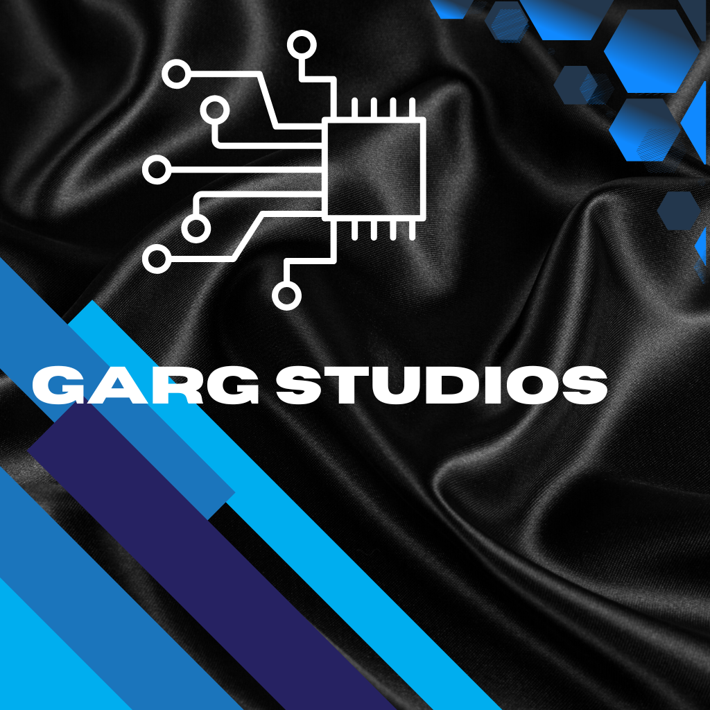

<h1>Garg Studios™</h1>

Config files for Garg Studios™

<h2>Mission Statement</h2>

We create software for the fun of it. We literally just like coding.

<h2>Community Hangout</h2>
<ul>
  <li>Join our <a href="https://discord.gg/Y4NesTYDbz">Discord</a></li>
</ul>

<h2>Our Favorite Tech Stacks</h2>
<!--TODO: add images here with links to documentation and SwiftUI-->
<ol>
  <li>Python: We love using Python for many of our project backends due to its extensive library support</li>
  <li>Django: Django is an easy-to-use backend web development framework we love using</li>
  <li>HTML/SCSS/CSS: Our static sites utilize either CSS or SCSS for styling and a semantic HTML page easy for accessibility tools</li>
  <li>TypeScript: We've used TypeScript along with Python to build Exchange Bot, a stock/crypto price checker with a currency conversion function.</li>
</ol>

<h2>Featured Repositories</h2>

These are our top projects.

<h3>Matplotlib Intro [BETA]</h3>

A simple repo that contains basic syntax for the Python data visualization library <a href="https://matplotlib.org/">matplotlib</a>. The project features a README.md file that allows beginners to learn some basic matplotlib syntax with examples of basic charts.

<h2>Projects in Development</h2>
<ol>
  <li>Quest Tracker: a Django-based website for video games which allows you to track what items you need to finish an in-game quest. [ALPHA]</li> 
  <li>Font Tester: an iOS app which allows you to preview text in different fonts and font sizes [PRE-ALPHA]</li>
  <li>Our website: a simple static site which allows people to view our projects and contact us [ALPHA]</li>
  <li>HackerCube: a CLI game built in Java where you play as a hacker trying to hack different systems [ALPHA]</li>
  <li>Standard Web Boilerplate: a simple static website boilerplate for beginners to not get overwhelmed with huge templates [ALPHA]</li>
</ol>

<h2>Legal and Guidelines</h2>
<ul>
  <li>See the project <a href="LICENSE">license</a></li>
  <li>Most of our projects are registered under the PolyForm Non-Commerical License 1.0.0. Read more <a href="https://polyformproject.org/licenses/noncommercial/1.0.0">here.</a></li>
  <li>View our <a href="SECURITY.md">SECURITY.md</a> file in case you discover an exploit.</li>
</ul>
